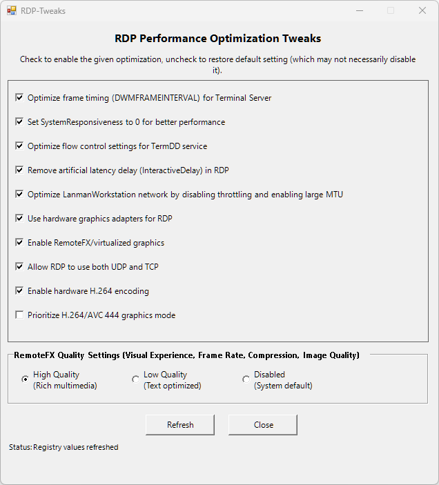

# RDP-Tweaks

A PowerShell script with a graphical user interface (GUI) to apply various performance and quality tweaks for Microsoft Remote Desktop Protocol (RDP). This tool simplifies the process of configuring RDP settings on a host machine to improve frame rate, reduce latency, and enhance the overall remote desktop experience, especially for graphically intensive applications.



Based largely on [Pushing Remote FX to its limits](https://www.reddit.com/r/sysadmin/comments/fv7d12/pushing_remote_fx_to_its_limits/).

## How to Use

Run PowerShell as administrator, then copy and paste the following command:

```
& ([scriptblock]::Create((irm "https://raw.githubusercontent.com/fstanis/RDP-Tweaks/refs/heads/main/RDP-Tweaks.ps1")))
```

## Optimizations Overview

The script provides a GUI to manage the following registry-based RDP optimizations:

### General Performance

- **Optimize frame timing (DWMFRAMEINTERVAL)**: Sets a lower frame interval for the Desktop Window Manager to allow for higher frame rates (targeting ~60 FPS).
- **Set SystemResponsiveness to 0**: Prevents multimedia playback from throttling network performance, which can improve RDP responsiveness.
- **Optimize flow control settings for TermDD service**: Adjusts bandwidth allocation for display and virtual channels to prioritize a smoother visual experience.
- **Remove artificial latency delay (InteractiveDelay)**: Removes a small, built-in delay in RDP interactivity.
- **Optimize LanmanWorkstation network**: Disables network bandwidth throttling and enables support for larger network packets (MTU).
- **Turn off desktop composition**: Disables desktop composition even if the client requests it. Usually improves performance.

### Graphics and Encoding

- **Use hardware graphics adapters for RDP**: Forces RDP to use a hardware GPU for rendering, which is essential for graphically demanding applications.
- **Enable RemoteFX/virtualized graphics**: Enables the RemoteFX graphics virtualization features.
- **Allow RDP to use both UDP and TCP**: Configures the RDP transport protocol to use UDP for better performance on low-latency networks, with TCP as a fallback.
- **Enable hardware H.264 encoding**: Prefers using hardware-accelerated H.264/AVC video encoding, which is more efficient than software encoding.
- **Prioritize H.264/AVC 444 graphics mode**: Enables the highest quality H.264 mode (AVC 444) for pixel-perfect color accuracy, which is beneficial for text and sharp images.
- **Use XDDM drivers instead of WDDM**: Disables Windows Display Driver Model (WDDM) so sessions will attempt to use the older Windows 2000 Display Driver Model (XDDM) instead.
- **Turn off font smoothing**: Disables font smoothing for remote sessions. Enable this if you see issues with text rendering.

### RemoteFX Quality Presets

The script also allows you to configure a group of RemoteFX settings using presets:

- **High Quality**: Optimized for a high quality connection over a fast connection, reduces various compression settings to minimum compression.
- **Low Quality**: Optimized for sub-optimal connections, it increases various compression settings to maximum compression.
- **Disabled**: Reverts to system default settings.

## Similar projects

- [BetterRDP](https://github.com/Upinel/BetterRDP)
- [TurboRemoteFX](https://github.com/maxprehl/TurboRemoteFX)

## Disclaimer

This script modifies the Windows Registry, use it at your own risk.
